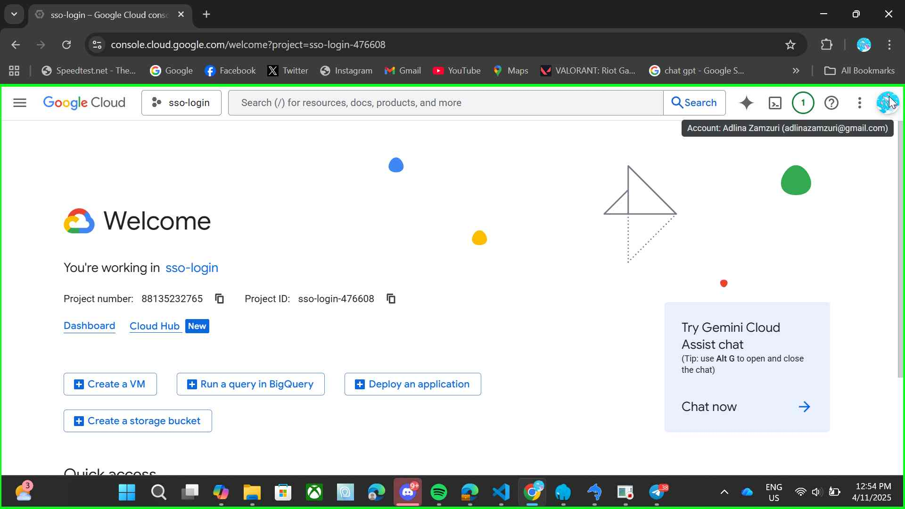
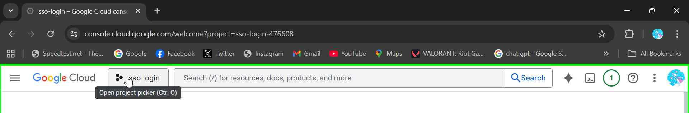
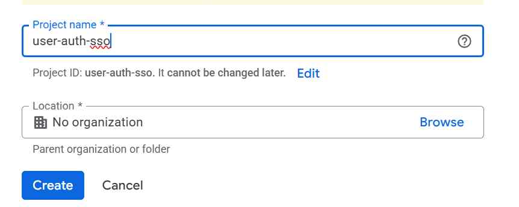

# Third-Party OAuth Providers — Setup & Integration

> **Purpose:** This document explains, step-by-step, how to obtain and configure OAuth client credentials for common third‑party providers (Google, Facebook, X, Apple). It also shows how to wire them into a Laravel backend (Socialite) and how to use them from a Flutter client. Screenshots and a `cacert.pem` guidance section are included.

---

## Table of contents

1. [Overview](#overview)
2. [Prerequisites](#prerequisites)
3. [Common concepts](#common-concepts)
4. [Provider setup instructions (per provider)](#provider-setup)
   * [Google](#google)
   * [Facebook / Meta](#facebook--meta)
   * [X](#twitter--x)
   * [Apple Sign in with Apple](#apple)
5. [Laravel (Socialite) configuration](#laravel-socialite-configuration)
6. [Server TLS / cacert.pem guidance](#cacertpem-guidance)
7. [Testing tips (force reauth for certain providers)](#testing-tips)
8. [Appendix — sample `.env` variables & code snippets](#appendix)

---

## Overview

This README documents the exact steps QA/Dev/DevOps or other engineers should follow to create OAuth client credentials on 3rd party provider consoles and plug them into our Laravel backend (using Socialite) to authenticate users via third-party providers.

---

## Prerequisites

* Access to the provider developer console (Google Cloud, Meta for Developers, GitHub Settings, GitLab, Slack, Bitbucket, LinkedIn, Apple).
* A Laravel app with `laravel/socialite` installed.
* A Flutter app capable of receiving a redirect (deep link / custom scheme or universal link).
* A registered redirect URI that points to your backend endpoint: `https://<YOUR_DOMAIN>/auth/{provider}/callback`
* (Optional) A `cacert.pem` bundle if your environment needs an explicit CA bundle for Guzzle.

---

## Common concepts

* **Client ID / Client Secret**: credentials issued by the provider.
* **Redirect URI**: URL provider will redirect to after user authorizes.
* **Scopes**: what data you request (`email`, `profile`, etc.).
* **State**: anti-CSRF token for OAuth flows.

---

## Provider setup

Below are practical step-by-step instructions. Insert screenshots in `assets/images/` next to this README and reference them with standard Markdown `` tags.

> **Tip:** capture each console page screenshot and name them clearly: `google-console-create-credentials.png`, `facebook-app-settings.png`, etc.

## 🟦 Google OAuth Setup (Socialite Integration)

This section walks through creating Google OAuth credentials for your Laravel Socialite integration.  
Follow the steps carefully — each includes a placeholder for screenshots you can replace once captured.

---

### Step 1: Log in to Google Cloud Console
1. Go to [Google Cloud Console](https://console.cloud.google.com/).
   - Sign in with your Google account.
   - You’ll land on the Google Cloud dashboard.

2. After signing in, confirm that you can see the project dropdown on the top bar.
   
   *Main Google Cloud dashboard view.*

---

### Step 2: Create a New Project
1. Click the project dropdown on the top bar.
    
    *Open project dropdown on top bar.*
2. Select **New Project**.
    
    *Create new project.*
3. Enter a project details (e.g., `user-auth-sso`).
   *If there are organization associated to the project, change according to the associated organization folder.*
    
    *Create new project.*
4. Click **Create**.
5. Project created
    
    *Project created.*

> 💡 *Note: It may take a few seconds for the new project to be created.*
    
---

### Step 3: Configure OAuth Consent Screen
1. In the left sidebar, go to **APIs & Services → OAuth consent screen**.
2. Choose **External** and click **Create**.
3. Fill out the following fields:
   - App name  
   - User support email  
   - Developer contact email
4. Scroll down and click **Save and Continue**.

   
   *Filling in OAuth consent screen details.*

5. On the next pages (Scopes and Test Users), you can click **Save and Continue** until the summary.

---

### Step 4: Create OAuth Client ID
1. Navigate to **APIs & Services → Credentials**.
2. Click **+ Create Credentials → OAuth Client ID**.
3. Choose **Web Application**.
4. Fill out:
   - Name: `Laravel Socialite`
   - Authorized JavaScript origins: your app’s base URL (e.g., `http://localhost:8000`)
   - Authorized redirect URIs:  
     ```
     http://localhost:8000/auth/google/callback
     https://yourdomain.com/auth/google/callback
     ```
5. Click **Create**.

   
   *Creating the OAuth Client ID for Socialite.*

---

### Step 5: Copy Your Client Credentials
1. A dialog will appear with your **Client ID** and **Client Secret**.
2. Copy both and store them safely.

   
   *Google OAuth Client credentials window.*

3. Add them to your `.env` file:

   ```env
   GOOGLE_CLIENT_ID=your-client-id
   GOOGLE_CLIENT_SECRET=your-client-secret
   GOOGLE_REDIRECT_URI=${APP_URL}/auth/google/callback

---

### Facebook (Meta)

1. Go to Facebook for Developers → My Apps → Create App.
2. Add the **Facebook Login** product.
3. Under Settings → Basic, copy App ID and App Secret.
4. Under Facebook Login → Settings, set the Valid OAuth Redirect URIs to `https://your-domain.com/auth/facebook/callback`.
5. Add required permissions (e.g., `email`).

---

### GitHub

1. Go to GitHub → Settings → Developer settings → OAuth Apps → New OAuth App.
2. Set Authorization callback URL to `https://your-domain.com/auth/github/callback`.
3. Save Client ID / Client Secret.

> Note: GitHub does not support `prompt=login`. See testing tips for forcing reauth.

---

### GitLab

1. Go to GitLab → User Settings → Applications → New application (or Admin area for self-hosted).
2. Add redirect URI `https://your-domain.com/auth/gitlab/callback`.
3. Save Application ID / Secret.

---

### Slack

1. Go to Slack API → Create an App.
2. Add OAuth & Permissions, set Redirect URLs.
3. Install the app to your workspace and get Client ID/Secret.

---

### Bitbucket

1. Bitbucket Settings → OAuth → Add consumer.
2. Set callback URL `https://your-domain.com/auth/bitbucket/callback`.
3. Save Key/Secret.

---

### LinkedIn

1. Go to LinkedIn Developer Portal → Create app.
2. Add Authorized Redirect URLs.
3. Request `r_liteprofile` and `r_emailaddress` scopes if needed.

---

### Apple (Sign in with Apple)

1. Register your app in Apple Developer → identifiers and Services.
2. Configure Sign in with Apple and generate keys.
3. Apple uses JWT-based client secret; read Apple docs for details.

---

## Laravel (Socialite) configuration

1. Add your client keys to `.env`:

```dotenv
GITHUB_CLIENT_ID=xxx
GITHUB_CLIENT_SECRET=yyy
GITHUB_REDIRECT=https://your-domain.com/auth/github/callback
```

2. `config/services.php` example:

```php
'github' => [
  'client_id' => env('GITHUB_CLIENT_ID'),
  'client_secret' => env('GITHUB_CLIENT_SECRET'),
  'redirect' => env('GITHUB_REDIRECT'),
],
```

3. Controller best practice (use `with()` and dynamic params):

```php
public function redirect($provider)
{
    $supported = ['google', 'github', 'facebook', 'linkedin', 'gitlab', 'bitbucket', 'slack', 'x', 'apple'];
    abort_unless(in_array($provider, $supported), 404);

    $driver = Socialite::driver($provider)->stateless();

    $params = config("oauth_providers.$provider", []);
    if (!empty($params)) {
        $driver->with($params);
    }

    session(['last_oauth_provider' => $provider]);
    return $driver->redirect();
}
```

4. Example `config/oauth_providers.php` (commit to repo):

```php
return [
  'google' => ['prompt' => 'login'],
  'facebook' => ['auth_type' => 'reauthenticate'],
  'github' => ['state' => null], // we will generate per-request
  'gitlab' => ['state' => null],
  'bitbucket' => ['state' => null],
  'slack' => ['state' => null],
];
```

> When using `state => null` you can programmatically set it to `uniqid('reauth_', true)` before calling `with()`.

---

## cacert.pem guidance (Guzzle / local dev)

Some Windows/PHP environments (like Laragon) don’t automatically use a system CA bundle. If you hit TLS errors when Socialite/Guzzle attempts `->user()` (e.g. `SSL certificate problem: unable to get local issuer certificate`), provide a `cacert.pem` and point Guzzle to it.

1. Download the latest `cacert.pem` from the curl project: [https://curl.se/docs/caextract.html](https://curl.se/docs/caextract.html)
2. Place it in a safe path in your project (example): `storage/certs/cacert.pem`.
3. Use a custom Guzzle client in Socialite calls:

```php
use GuzzleHttp\Client;

$client = new Client(['verify' => storage_path('certs/cacert.pem')]);
$socialUser = Socialite::driver($provider)->stateless()->setHttpClient($client)->user();
```

4. **Do not commit** the `cacert.pem` if it’s environment-specific; instead add instructions and optionally an example file.

---

## Flutter integration notes

1. Place API logic in `lib/services/api_service.dart` (HTTP client) and use `flutter_web_auth_2` or external browser + deep link for the OAuth flow.

2. Typical flow (recommended):

   * Flutter opens the backend endpoint: `https://your-domain.com/auth/{provider}` (this will redirect to provider console)
   * Provider redirects back to backend callback: `/auth/{provider}/callback`, backend exchanges code for token and then redirects to a **custom-scheme** deep link such as `myapp://auth?token=JWT`.
   * Flutter intercepts the deep link and stores token securely (e.g., `flutter_secure_storage`).

3. Example deep link callback handler:

```dart
final result = await FlutterWebAuth2.authenticate(
  url: 'https://your-domain.com/auth/google',
  callbackUrlScheme: 'myapp',
);
final token = Uri.parse(result).queryParameters['token'];
```

---

## Testing tips — forcing reauth for GitHub/GitLab/Slack/Bitbucket

* Many providers (GitHub, GitLab, Bitbucket, Slack) **do not honor** `prompt=login`.
* Two practical techniques for test workflows:

  1. Add a random `state` per request: `->with(['state' => uniqid('reauth_', true)])` to help force authorization UI.
  2. In local test, redirect user to the provider logout page if available (Slack, GitLab have signout endpoints). GitHub/Bitbucket do not have simple logout URLs you can rely on.

---

## Security & best practices

* Store client secrets in environment variables, never commit them.
* Validate `state` in callbacks to prevent CSRF.
* Use `stateless()` if you do not rely on session state and implement your own state handling.
* Limit scopes to the minimum required.
* Rotate client secrets periodically.

---

## How to make this README look professional

* **Top-level summary**: one-liner + badges (build, docs, license).
* **Table of contents**: helps navigation for long docs.
* **Clear headings and code blocks**: use fenced code blocks and language hints.
* **Screenshots + captions**: place images in `assets/images/` and reference them.
* **Examples + copy-paste snippets**: provide ready-to-use `.env` and `config/services.php` snippets.
* **Checklist for QA**: short tasks (create client id, add redirect, test login, test logout, verify token)
* **Changelog**: small `CHANGELOG.md` or maintenance notes for console UI changes.

Visual tips:

* Use consistent screenshot dimensions.
* Add small arrows or circles on screenshots (use simple image editor) to highlight fields.
* Keep sections short; link to provider docs for deeper details.

Badge example at top of README (use shields.io):

```md
[](LICENSE)
[](README.md)
```

---

## Appendix — sample .env and snippets

`.env` (example):

```dotenv
APP_URL=https://your-domain.com
GITHUB_CLIENT_ID=your_github_id
GITHUB_CLIENT_SECRET=your_github_secret
GITHUB_REDIRECT=${APP_URL}/auth/github/callback

GOOGLE_CLIENT_ID=...
GOOGLE_CLIENT_SECRET=...
GOOGLE_REDIRECT=${APP_URL}/auth/google/callback
```

Controller callback example (use Guzzle cacert path):

```php
use GuzzleHttp\Client;

try {
    $client = new Client(['verify' => storage_path('certs/cacert.pem')]);
    $socialUser = Socialite::driver($provider)->stateless()->setHttpClient($client)->user();
} catch (\Exception $e) {
    Log::error('Socialite error', ['message' => $e->getMessage()]);
    return redirect()->route('login')->withErrors(['social_login' => 'Login failed']);
}
```

---

## Where to place images and cacert

```
repo-root/
  README.md (this file)
  assets/
    images/
      google-console-create-credentials.png
      facebook-app-settings.png
  storage/
    certs/
      cacert.pem (example or symlinked to shared CA bundle)
```

> **Note:** Do not commit private keys or actual cacert if organization policy prevents it. Instead add a `cacert.example` or instructions to download.

---

If you want, I can:

* Add real example screenshots into `assets/images/` if you upload them here.
* Create a minimal `cacert.example` file (placeholder) and show how to point Guzzle to it.
* Produce a `CHANGELOG` and a short `qa-checklist.md`.

Which would you like me to do next?
